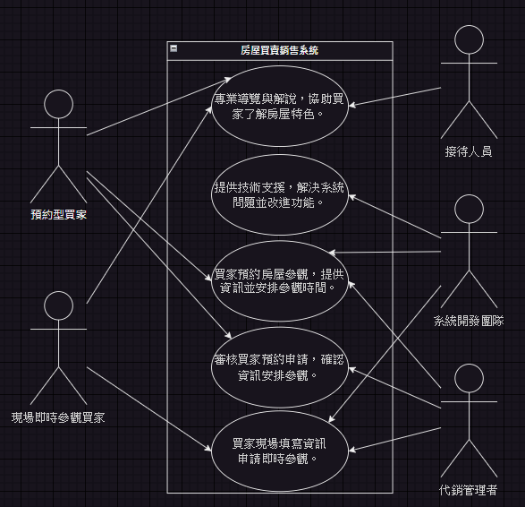
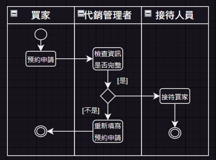
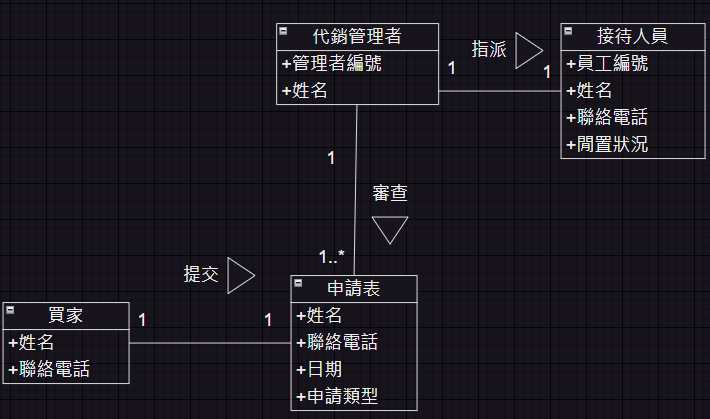

# 期中考-期中-Mid 
<!--(期中標籤註記，該行不能刪，作為驗證標籤，該檔案若沒該份標籤，代表直接貼上saample，直接0分)-->

>
>學號：111111102
> 
>姓名：張紘榤
> 

本份文件包含以下主題：(至少需下面兩項，若是有多者可以自行新增)
- [x] 答題

## 答題
>1. 

(a)
### 利害人關係表
| 利害關係人 | 目標 |
| ------ | ------ |
| **前台：** |
| 預約型買家 | 1.提供簡便的預約流程，確保預約流程簡單易行。 2.提供即時的信息答覆，確保買家收到準確的預約確認。 3.提供專業的服務建議，讓買家在參觀前能有更清晰的準備。 4.確保預約申請的及時性和準確性。|
| 現場即時參觀買家 | 1.提供即時參觀機會，確保現場即時參觀買家能隨時參觀。 2.提供即時的參觀安排，讓買家無需事先預約，隨時可以立即參觀。 3.提供貼心的服務，讓參觀體驗更加舒適。 4.獲得即時的服務和解答，以解決任何可能出現的問題。|
| **後台：** | 
| 代銷管理者 | 1.提高管理效率，確保申請審核。 2.提供即時決策支援，確保管理者能即時了解情況。 3.促進交易成功，確保買家需求得到充分滿足並完成交易。 4.增加房屋參觀的成功率，以提高交易成交率。 |
| 系統開發團隊 |1.設計完善的系統，確保系統功能完善。 2.提供持續技術支援，確保系統運行穩定且及時解決問題。 3.滿足客戶需求，確保系統符合代銷公司的需求，提供良好的使用體驗。 4.提供即時的系統更新和功能改進。|
| 接待人員 |1.有效地接待預約的買家，提供良好的服務體驗。 2.提供清晰的導覽和解說，以及解決任何可能出現的問題。 3.提供準確資訊，幫助顧客做出明智的決定。 4.提供豐富的參觀體驗，使買家能夠充分了解房屋的特點和周邊環境|  

### 事件表
| 事件 | 使用案例 |
| ---- | ------- |
| 1.預約房屋參觀 | 買家預約房屋參觀，提供資訊並安排參觀時間。|
| 2.即時參觀房屋 | 買家現場填寫資訊申請即時參觀。 |
| 3.審核預約申請 | 審核買家預約申請，確認資訊安排參觀。 |
| 4.系統技術支援 | 提供技術支援，解決系統問題並改進功能。 |
| 5.專業導覽服務 | 專業導覽與解說，協助買家了解房屋特色。 |

(b)
### 使用案例圖

(c)
### 使用案例
| 使用案例名稱 | 預約房屋參觀 |
| ---- | ------- |
| 使用案例描述 | 買家預約房屋參觀，提供資訊並安排參觀時間。 |
| 主要參與者 | 預約型買家、代銷管理者、系統開發團隊 |
| 利害關係人與目標 | 預約型買家：提供簡便的預約流程，確保預約流程簡單易行。 代銷管理者：促進交易成功，確保買家需求得到充分滿足並完成交易。 系統開發團隊：設計完善的系統，確保系統功能完善。 |
| 前置條件 | 買家進入頻道並點選預約制 Line選單。 |
| 後置條件 | 買家成功預約後，系統通知代銷管理者並安排參觀。 |
| 主要成功情節 | 買家在系統中填寫完整的預約表格，並成功預約了特定時間的房屋參觀。 |
| 例外情節與其他需求 | 若買家提供的資訊不完整，系統應提供相應提示並要求修正。 |

| 使用案例名稱 | 即時參觀房屋 |
| ---- | ------- |
| 使用案例描述 | 買家現場填寫資訊申請即時參觀。 |
| 主要參與者 | 現場即時參觀買家、代銷管理者、系統開發團隊 |
| 利害關係人與目標 | 現場即時參觀買家：提供即時參觀機會，確保現場即時參觀買家能隨時參觀。 代銷管理者：增加房屋參觀的成功率，以提高交易成交率。 滿足客戶需求，確保系統符合代銷公司的需求，提供良好的使用體驗。|
| 前置條件 | 買家進入頻道並點選現場制Line選單。|
| 後置條件 | 申請進入後台待代銷管理者審核。 |
| 主要成功情節 | 買家填寫申請並提交後，申請成功。 |
| 例外情節與其他需求 | 買家未填寫完整資訊，系統無法提交申請，買家需重新填寫審核預約申請。 |

| 使用案例名稱 | 審核預約申請 |
| ---- | ------- |
| 使用案例描述 | 代銷管理者審核買家預約申請，確認資訊安排參觀。 |
| 主要參與者 | 代銷管理者、預約型買家 |
| 利害關係人與目標 | 代銷管理者：提高管理效率，確保申請審核。 預約型買家：確保預約申請的及時性和準確性。|
| 前置條件 | 預約型買家已提交預約申請並提供所需資訊。 |
| 後置條件 | 預約型買家獲得預約確認，能夠按時參觀房屋。 |
| 主要成功情節 | 代銷管理者審核通過預約申請，並安排買家參觀，買家收到預約確認。 |
| 例外情節與其他需求 | 若申請資訊不完整，代銷管理者需與買家進行溝通，以確保資訊準確性。 |

| 使用案例名稱 | 系統技術支援 |
| ---- | ------- |
| 使用案例描述 | 提供技術支援，解決系統問題並改進功能。 |
| 主要參與者 | 系統開發團隊、代銷管理者 |
| 利害關係人與目標 |  系統開發團隊：提供即時的系統更新和功能改進。 代銷管理者：提供即時決策支援，確保管理者能即時了解情況。|
| 前置條件 | 代銷管理者發現系統存在問題或需求改進。 |
| 後置條件 | 系統問題得到解決，系統功能可能進行更新或改進。 |
| 主要成功情節 | 系統開發團隊成功解決代銷管理者報告的系統問題，或完成系統功能的更新與改進。 |
| 例外情節與其他需求 | 若系統問題複雜，系統開發團隊需與代銷管理者進行進一步的溝通與協商。 |

| 使用案例名稱 | 專業導覽服務 |
| ---- | ------- |
| 使用案例描述 | 專業導覽與解說，協助買家了解房屋特色。 |
| 主要參與者 | 接待人員、預約型買家、現場即時參觀買家 |
| 利害關係人與目標 | 接待人員：有效地接待預約的買家，提供良好的服務體驗。 預約型買家：提供專業的服務建議，讓買家在參觀前能有更清晰的準備。 現場即時參觀買家：提供貼心的服務，讓參觀體驗更加舒適。|
| 前置條件 | 買家已預約成功參觀房屋。 |
| 後置條件 | 接待人員專業服務，提高了買家的興趣。 |
| 主要成功情節 | 買家成功預約參觀房屋，接待人員提供專業導覽服務。 |
| 例外情節與其他需求 | 買家未成功預約房屋，需重新填寫預約。 |

### 活動圖

(d)
### 初步類別圖

>2. 

(a)

(b)

(c)

(d)